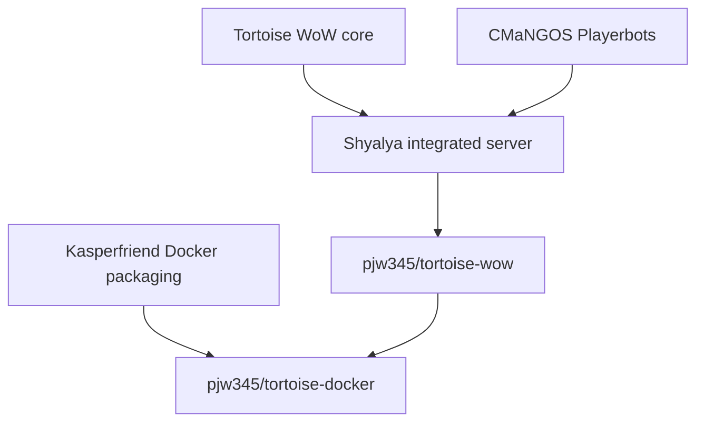

# Tortoise-WoW

> [!NOTE]
> **Project status.** This repository continues the retired Shyalya Playerbots
> integration as a deliberately maintained, source-pinned Turtle WoW server.
> Core, Playerbots and deployment updates are reviewed separately; this fork
> does not automatically merge or deploy either upstream.

This is an unofficial, community-driven restoration of the 1.18.1 patch of Turtle-WoW, with some additions to allow for customization.  
Do not represent this project, or anyone using it, as the original creators.  
This project targets version 1.18.1 build 7272.

Portions of this project are ported from AzerothCore and VMaNGOS.
See `AUTHORS.md` for specific contributions.

## Project lineage and maintenance

- The **Tortoise WoW core** owns the world server, protocol, persistence,
  creatures, quests, spells, loot, maps and scripted content.
- **CMaNGOS Playerbots** supplies the AI strategies that control server-side
  `Player` characters through socketless/headless sessions.
- **Shyalya's fork** combined those two codebases and supplied the integration
  from which this source repository descends.
- **Kasperfriend's repository** packaged Shyalya's server for Docker; our Docker
  fork retains that packaging lineage but pins and builds this maintained source.

See [Project lineage and upstream policy](docs/PROJECT_LINEAGE.md) for the
repository history, current upstream status and rules used when importing fixes.

> [!CAUTION]
> The client version targeted is the unmodified 1.18.1.7272 with 2026-04-12 hotfixes client, the final client version of Turtle-WoW.  
> Any client that does not match the above specifications will likely have a myriad of issues.  
> Several of the Turtle-WoW successor servers do __not__ offer the correct client version for this project.  
> Use the [`dbc_verifier.py`](tools/dbc_verification/dbc_verifier.py) script to verify your extracted DBC files are the correct versions.  
>   
> You only need to use the `mapextractor` tool to extract all DBC files quickly, not the full vmap extract and build.  
> A full SHA-256 manifest can be found in the [`DBC verification`](tools/dbc_verification/) folder.  
> This manifest was retrieved from https://launcher.turtlecraft.gg/api/manifest/EU on 2026-07-14.

## Module System

Optional features can be added as modules under the `modules/` folder.
A module is discovered when it has a `src/` directory, and can include its own C++ scripts, config templates, and database migrations.

Modules can be built statically, dynamically, or disabled with the `MODULES` CMake option.
Each discovered module also gets its own `MODULE_<NAME>` cache option for overriding the global setting.  
Most modules can be ported from AzerothCore with minimal effort.  

Modules can be given the topic [`tortoise-module`](https://github.com/topics/tortoise-module) for visibility.  

See `modules/README.md` for module layout, build options, config loading, SQL migrations, and authoring notes.

## Operating Systems

* **[Windows][15]**, 32 bit and 64 bit. Windows Server 2008 (or newer) or Windows 8 (or newer) is recommended.
* **Linux**, 32 bit and 64 bit. [Ubuntu 22.04 LTS][14] is recommended. Other distributions with similar package versions will work, too.
Of course, newer versions should work, too. In the case of Windows, matching server versions will work, too.

## Dependencies

* **[Git][1] / [GitHub for Windows][2]**: This version control software allows you to get the source files in the first place.
* **[MySQL][3]** / **[MariaDB][4]**: These databases are used to store content and user data.
* **[ACE][5]**: aka Adaptive Communication Environment, provides us with a solid cross-platform framework for abstracting operating system specific details.
* **[Recast][21]**: In order to create navigation data from the client's map files, Recast is used to do the dirty work. It provides functions for rendering, pathing, etc.
* **[G3D][6]**: This engine provides the basic framework for handling 3D data and is used to handle basic map data.
* **[Stormlib][7]**: Provides an abstraction layer for reading from the client's data files.
* **[Zlib][8]/[Zlib for Windows][9]** provides compression algorithms used in both MPQ archive handling and the client/server protocol.
* **[Bzip2][10]/[Bzip2 for Windows][11]** provides compression algorithms used in MPQ archives.
* **[OpenSSL][12]/[OpenSSL for Windows][13]** provides encryption algorithms used when authenticating clients.

To build this project, follow any MaNGOS/MaNGOS Zero build guide, with the addition of ACE.

## Database Setup

1. Manually import `sql/create_databases.sql`
2. Manually import all SQL scripts in the `sql/base` folder
3. Run `mangosd` to automatically import and track updates  

This will be streamlined once the core is more up to date.

## Contributing

Contributions are welcome, but I may be slow to review and merge PRs.

See `CONTRIBUTING.md` for ways to get started.

[1]: http://git-scm.com/ "Git - Distributed version control system"
[2]: http://windows.github.com/ "github - windows client"
[3]: https://dev.mysql.com/downloads/ "MySQL - The world's most popular open source database"
[4]: https://mariadb.org/download/ "MariaDB - An enhanced, drop-in replacement for MySQL"
[5]: http://www.dre.vanderbilt.edu/~schmidt/ACE.html "ACE - The ADAPTIVE Communication Environment"
[6]: http://sourceforge.net/projects/g3d/ "G3D - G3D Innovation Engine"
[7]: http://zezula.net/en/mpq/stormlib.html "Stormlib - A library for reading data from MPQ archives"
[8]: http://www.zlib.net/ "Zlib"
[9]: http://gnuwin32.sourceforge.net/packages/zlib.htm "Zlib for Windows"
[10]: http://www.bzip.org/ "Bzip2"
[11]: http://gnuwin32.sourceforge.net/packages/bzip2.htm "Bzip2 for Windows"
[12]: http://www.openssl.org/ "OpenSSL - The Open Source toolkit for SSL/TLS"
[13]: http://slproweb.com/products/Win32OpenSSL.html "OpenSSL for Windows"
[14]: http://www.ubuntu.com/ "Ubuntu - The world's most popular free OS"
[15]: http://windows.microsoft.com/ "Microsoft Windows"
[21]: http://github.com/memononen/recastnavigation "Recast - Navigation-mesh Toolset for Games"
