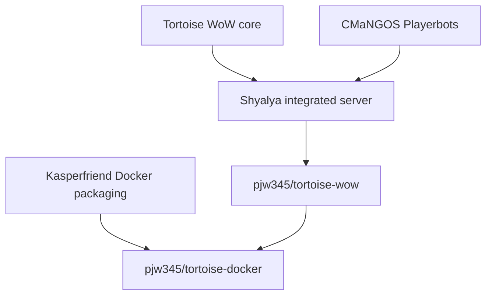

# Project lineage and upstream policy

Status checked: 2026-10-03.

This document records where the server came from, which repository owns each
kind of behaviour, and how upstream changes are evaluated. It is attribution
and maintenance guidance, not a claim of affiliation with Turtle WoW, Blizzard
Entertainment, CMaNGOS or the named upstream maintainers.

## Lineage

| Layer | Repository or historical source | Responsibility |
| --- | --- | --- |
| Game server | [`tortoise-wow/tortoise-wow`](https://github.com/tortoise-wow/tortoise-wow) | World simulation, client protocol, persistence, characters, creatures, quests, spells, loot, maps and scripts. |
| Bot intelligence | [`cmangos/playerbots`](https://github.com/cmangos/playerbots) | AI strategies, actions, triggers, combat, movement, travel, looting, commands and random-bot management. |
| Historical integration | `Shyalya/tortoise-wow` | Combined the Turtle server and Playerbots and supplied the core/module integration inherited here. |
| Maintained integrated source | [`pjw345/tortoise-wow`](https://github.com/pjw345/tortoise-wow) | Preserves that integration and carries reviewed Turtle-specific corrections and tests. |
| Historical deployment | [`kasperfriend/tortoise-docker`](https://github.com/kasperfriend/tortoise-docker) | Dockerfile, Compose stack and operational helper scripts around Shyalya's server. It is packaging, not the owner of core or bot gameplay logic. |
| Maintained deployment | [`pjw345/tortoise-docker`](https://github.com/pjw345/tortoise-docker) | Builds an explicitly pinned commit from the maintained source repository and supplies the tested runtime configuration. |

A Playerbot is a server-side `Player` character rather than an ordinary
creature AI. It retains player systems such as inventory, quests, spells,
groups and persistence, while its decisions come from the Playerbots engine and
its session is socketless/headless instead of being driven by a human client.

## Current upstream status

### Shyalya source

The inherited README announced that Shyalya's fork would be discontinued and
archived after September 2026. The public `Shyalya/tortoise-wow` URL and GitHub
repository API returned 404 when checked on 2026-10-03, so it is no longer an
available upstream dependency.

The loss of that public URL does not remove our source history:

- the integrated source and relevant commit ancestry are preserved in this
  repository;
- Shyalya's generic module/headless-session hooks were also accepted into the
  canonical Turtle repository through 2026-09-14;
- the last separately captured Shyalya range was reviewed through commit
  `ef4ca228ea89a6a70de2c8b8de65d1df1c35a0ae` in
  [UPSTREAM_REVIEW_2026-09-05.md](UPSTREAM_REVIEW_2026-09-05.md);
- that review found one compiled gameplay candidate, Arathi Basin banner
  targeting. A later, tested AB correction is already present in this branch;
  the other changes were already equivalent or belonged to the unused
  dungeon-clear/test module and contained portability or lifecycle concerns.

There is therefore no known missing Shyalya change that should be imported
blindly. Any recovered mirror must be compared by commit and source behaviour,
not treated as a new authoritative upstream.

### Kasperfriend packaging

The Docker repositories share commit `af4701a1da1df1ea4eed2505cac5796709c3e96e`
as their current common ancestor. At the 2026-10-03 check:

- `pjw345/tortoise-docker` was eight commits ahead with pinned-source builds,
  corrected Playerbot SQL packaging, SOAP/build fixes, deployment hardening,
  attribution and the host game-port correction;
- `kasperfriend/tortoise-docker` had one commit on its side, `6145f55d`, which
  changes only the README to say that the repository no longer works after
  Shyalya retired their fork.

No unported runtime, build or deployment fix was found in Kasperfriend's current
branch. Continue to credit it as the packaging ancestor, but do not use it as a
source or gameplay upstream.

## Update policy

The three update streams stay separate:

1. **Turtle core:** review `tortoise-wow/tortoise-wow` for native server and
   content corrections. Port changes selectively because its current design
   removed the legacy in-core Playerbots path and its history conflicts with
   this integrated branch.
2. **Playerbots:** review `cmangos/playerbots` for bot behaviour. Adapt each
   change to Turtle's APIs and preserve local contracts; do not merge the
   repository wholesale or assume identically named CMaNGOS APIs are compatible.
3. **Deployment:** maintain Docker, Compose and operational scripts in
   `pjw345/tortoise-docker`. Builds must pin an exact source commit. Updating a
   container tag must never silently select a new source branch or rebuild the
   production databases.

Gameplay/core changes and packaging changes belong in separate commits and
normally separate pull requests. A source change proceeds through a feature
branch, compilation, focused regression checks and live play testing before it
is merged into `playerbots-development`. The deployment `.env` is updated only
after the exact image commit has built successfully.

## Attribution

Credit remains due to the canonical Turtle restoration contributors, the
CMaNGOS Playerbots contributors, Shyalya for the historical integration, and
Kasperfriend for the Docker packaging from which the maintained deployment fork
descends. Later maintenance in these forks does not erase that provenance.
